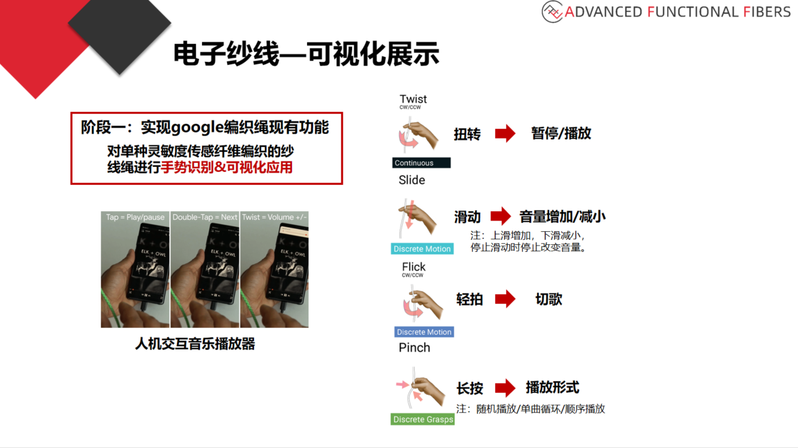

# 智能织物 - 音乐播放器 - 开发文档

---

## 项目资料

* [原项目文档](./README.old.md)
* [电子纱线ppt](./data/电子纱线绳音乐器.pptx)
* [电子纱线论文](./data/E-textile%20Microinteractions%20Augmenting%20Twist%20with.pdf)

---

## 总需求

* [ ] 本地音乐播放器 (80%)
* [ ] WebSocket通信 (80%)
* [x] 蓝牙通信 (100%)
* [ ] 控制音乐接口 (0%)
  * [ ] 状态：播放、暂停
  * [ ] 切歌：上一首、下一首
  * [ ] 音量：增加、减小
  * [ ] 列表：随机播放、单曲循环、顺序播放



---

## 参考资料

* ~~Java WebSocket~~ -> [Here](https://www.jianshu.com/p/7b919910c892)
* WebSocket 在线测试 -> [Here](http://www.websocket-test.com/)
* OkHttp WebSocket -> [Here1](http://www.voycn.com/article/android-appruhejiezhuokhttpshiyongwebsocketshixianyufuwuqishishishuangxiangtongxinshier) \ [Here2](https://blog.csdn.net/kris_fei/article/details/80286968)

---

## 工作记录

---

### 2021/5/27

* [x] ~~走通WebSocket通讯~~
* [ ] 服务器的算法返回数据有待处理
* [ ] 音乐播放器的全局控制未实现

---

### 2021/5/24

* [x] ~~走通蓝牙通讯流程，测试成功~~
* [x] ~~和服务器通讯的数据封装已完成，待测试~~
* [x] ~~WebSocket 通讯，待测试，包括数据格式、网络连接、返回内容处理等(5/27)~~

---

### 2021/5/23

* [x] ~~蓝牙通讯已经完成，框架重构，可以后台运行~~
* [x] ~~重写了蓝牙的操作机制，包括断开连接、收发数据等等...~~
* [x] ~~下一步，与WebSocket通讯，有待交接~~

---

### 2021/5/20

* [x] ~~添加WebSocket通信框架，依赖Okhttp 4.9.0，实现细节封装在WebSocketHandler类中，目前只是测试用，还未设置服务器地址~~
* ~~因为导入Okhttp 最新版本后（旧版本没有WebSocket）有一些AS和Gradle版本不匹配导致的错误，所以升级gradle到6.5，插件到4.1.3，重新导入项目的话还是比较麻烦的，emmmm~~
* [x] ~~__蓝牙通讯有待改进，目前只有测试界面，正式应用应该封装好，并且实现数据交互与转发(5/23已完成)__~~

---

### 2021/5/11

* [x] ~~添加蓝牙通信页面，可以搜索连接设备、收发信息，未实现通信控制逻辑~~
  * 侧边栏打开 -> 蓝牙设备
  

---

### 2021/5/6

* [x] ~~适配安卓8.0~~
* [x] ~~修改了包名(侵权行为)~~

---

### 2021/5/3

* [x] ~~App会和原作者写好的后台通讯，会报错 - 已修复~~

```Java
java.net.SocketTimeoutException: failed to connect to guolin.tech/13.70.26.68 (port 80) from /10.202.46.171 (port 43832) after 10000ms
```

* [x] ~~扫描本地歌曲时，数据库出错 - 已修复~~

```Java
java.lang.NullPointerException: Attempt to invoke virtual method 'int java.lang.String.length()' on a null object reference
  at com.yzbkaka.kakamusic.util.ChineseToEnglish.StringToPinyinSpecial(ChineseToEnglish.java:75)
  at com.yzbkaka.kakamusic.activity.ScanActivity$4.run(ScanActivity.java:224)
```

* [ ] 通知栏常驻的控制组件无法交互（点击无效），可能和安卓8.0以上改动有关 - 待修复

```Java
W/Notification: Use of stream types is deprecated for operations other than volume control
W/Notification: See the documentation for what to use instead with android.media.AudioAttributes to qualify your playback use case
```

* ~~修改了包名和部分UI显示，修复了MediaPlayer报错~~

---
